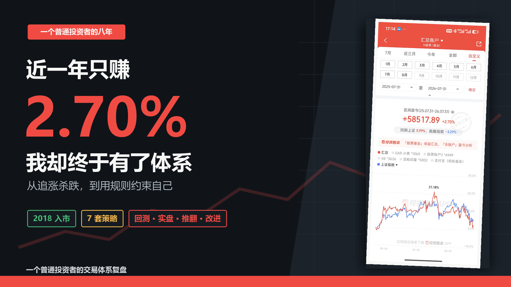
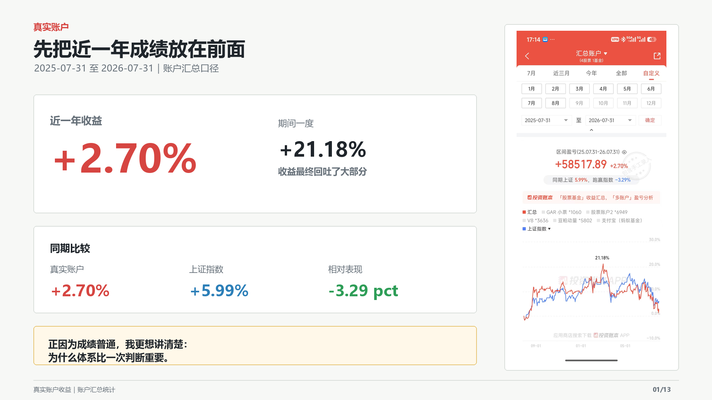
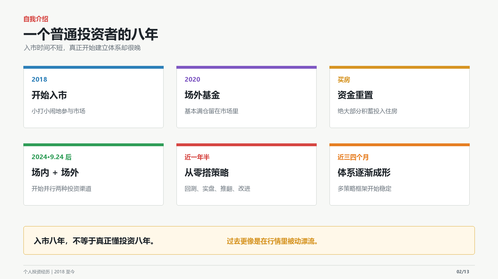
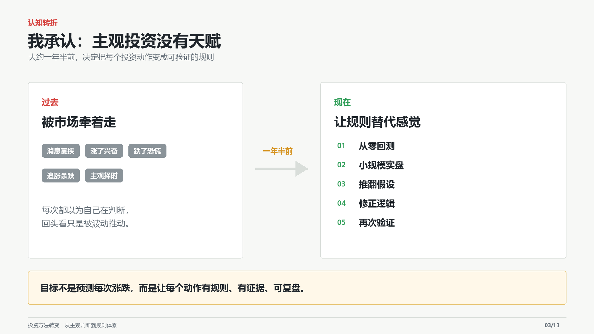
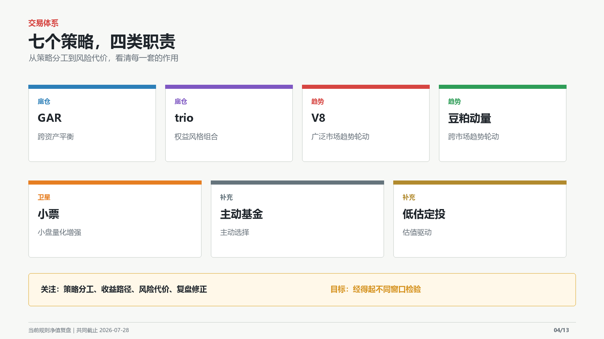
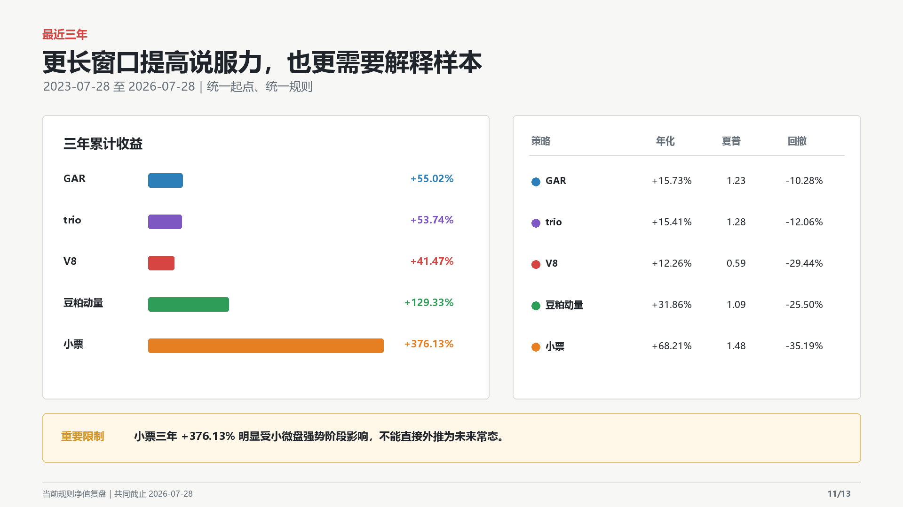
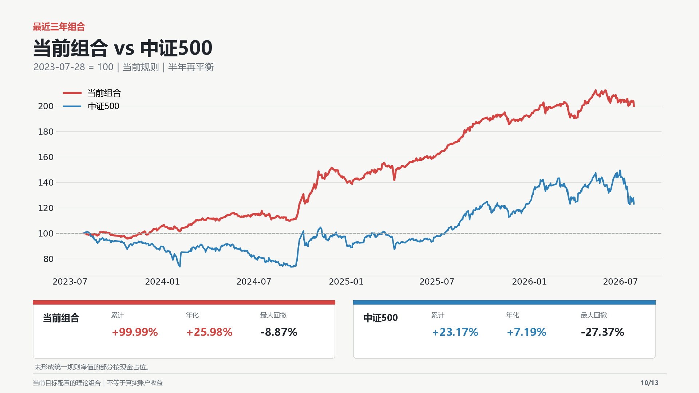
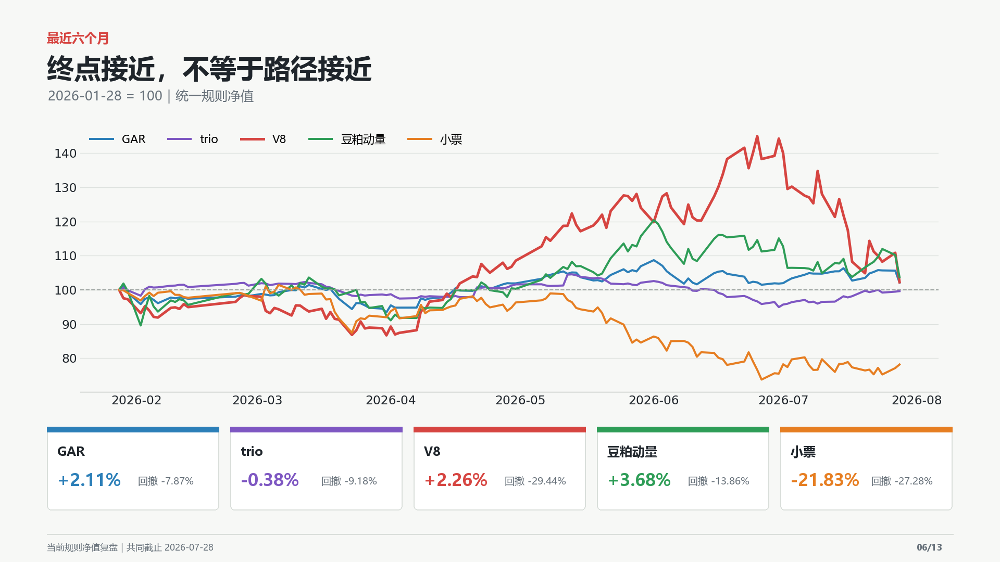
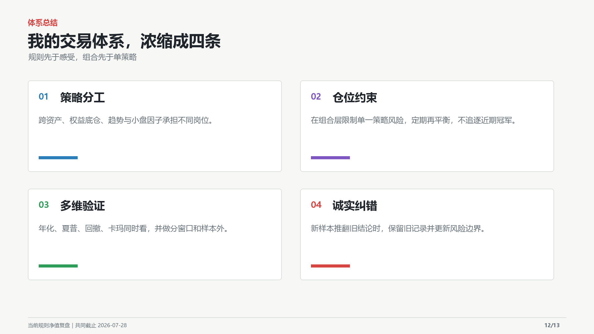

# 近一年只赚2.70%，我却终于搭出了自己的交易体系

> 一个普通投资者从追涨杀跌，到七套策略的八年复盘。

先把成绩放在前面。

从2025年7月31日到2026年7月31日，我的汇总账户收益是 **+2.70%**。同期上证指数上涨 **+5.99%**，我跑输了 **3.29个百分点**。期间账户一度上涨 **+21.18%**，但最后回吐了大部分。

这不是一张值得炫耀的答卷。我也不准备把自己包装成投资高手。

我真正想记录的是另一件事：一个普通投资者，怎样从被消息和市场震荡牵着走，慢慢搭出一套能够执行、能够复盘、也能够承认错误的交易体系。

*图1：真实账户收益包含不同建仓时间、资金进出和实际执行差异，不能与后文的规则净值混为一谈。*

## 入市八年，我其实走了很久的弯路

我从2018年开始接触投资，最初只是小打小闹。到2020年，我已经基本满仓场外基金。后来经历买房，绝大部分积蓄投入了房子，投资账户也接近重新起步。

2024年“9·24”之后，我开始场内、场外并行。随着年纪增长，我越来越觉得，工作之外还应该有一项能够长期积累、关键时刻可以傍身的能力。投资恰好是我愿意投入时间，也确实感兴趣的事情。

但入市早，不等于懂投资。

回头看过去，我就是一个普普通通的路边投资者：听到新逻辑就兴奋，市场上涨时担心错过，市场下跌时怀疑一切；被消息、情绪和短期涨跌裹挟着上下颠簸，追涨杀跌，却很少认真问自己三个问题：

我为什么买？什么情况下卖？如果判断错了，风险边界在哪里？

*图2：真正的变化不是入市年份变长，而是开始建立可验证、可执行的规则。*

## 转折点：承认自己没有主观投资的天赋

大约一年半前，我终于承认了一件不太好听、但很重要的事：依靠主观投资，咱没那个天赋。

继续猜消息、猜风格、猜涨跌，只会重复过去的循环。我需要的不是下一次蒙对，而是一套错了也知道错在哪里的方法。

于是我从零开始学习回测，探索策略，再用小规模实盘验证。这个过程并不顺利：实盘、推翻、改进、再实盘；数据口径出过问题，策略逻辑反复调整过，对回撤的认识也被新样本击穿过。

直到最近三四个月，整个框架才逐渐清晰。对我来说，体系化投资不是让模型代替思考，而是让规则替代冲动，让证据替代感觉。

## 七套策略，不是七个人争夺同一个冠军

目前我的投资体系由七套策略组成：GAR、trio、V8、豆粕动量、小票、主动基金和低估定投。

它们在组合中承担不同职责。

GAR偏向跨资产平衡，希望降低单一市场周期的影响；trio承担权益底仓角色；V8和豆粕动量提供不同来源的趋势收益；小票是高波动的卫星策略；主动基金和低估定投则保留一定的主动判断与估值思路。

它们并不争夺同一个“收益冠军”。有的负责防守，有的负责权益暴露，有的负责捕捉趋势，有的承担更高波动以换取不同的收益来源。

真正重要的不是某一套策略短期排名第一，而是当市场风格切换时，整个账户不会只剩下一种命运。

*图3：七套策略分为底仓、趋势、卫星和补充四类，通过组合层管理总体风险。*

## 先把三种收益口径分清楚

在看数据之前，必须先说明三个容易混淆的口径。

第一，前面的 **+2.70%** 是我的真实账户结果。它受到建仓时间、资金进出、实际成交和人工执行差异影响。

第二，下面五套策略的对比，是把当前定稿规则放到同一个历史起点，用同样本金重新计算得到的理论净值。它比较的是策略路径，不是我过去真实赚到的钱，也不是当时历史版本的逐日复现。

第三，组合曲线是在当前目标配置下，把已有连续规则净值的策略合成为一条理论曲线，并按半年再平衡。尚无统一规则净值的部分按现金占位。

这三种数据可以互相参照，但不能混着讲。

## 先看最近三年：高收益必须解释来源

从2023年7月28日到2026年7月28日，五套可统一计算的策略，累计收益分别为：GAR **+55.02%**、trio **+53.74%**、V8 **+41.47%**、豆粕动量 **+129.33%**、小票 **+376.13%**。

单看收益，小票几乎压倒性领先。但如果因此直接得出“小票最好”的结论，就忽略了这段时间小微盘风格强势的样本背景，也忽略了它 **-35.19%** 的最大回撤。

同一窗口内，GAR和trio的最大回撤分别约为 **-10.28%** 和 **-12.06%**；V8和豆粕动量则分别为 **-29.44%** 和 **-25.50%**。

这组数据给我的提醒不是“应该把钱都放到历史收益最高的策略”，而是：收益数字越漂亮，越要追问它来自稳定能力，还是某种特定市场阶段。

*图4：三年不是完整市场周期，尤其不能把小票历史结果直接外推成未来年化收益。*

## 把当前体系合在一起，再与中证500比较

如果按照当前目标配置合成组合，并在每年1月和7月的首个共同交易日恢复目标配置，2023年7月28日至2026年7月28日的理论结果是：

当前组合累计收益 **+99.99%**，年化 **+25.98%**，最大回撤 **-8.87%**；同期中证500价格指数累计收益 **+23.17%**，年化 **+7.19%**，最大回撤 **-27.37%**。

这条曲线让我看到了分散收益来源和定期再平衡的潜在价值，但它仍然只是历史规则净值的组合，不等于真实账户收益，更不是未来承诺。

而且，这套体系是在不断研究和筛选之后形成的，历史结果不可避免地面临模型选择、样本依赖和过拟合风险。真正有价值的检验，仍然是未来的样本外表现，以及我能否长期按规则执行。

*图5：当前规则理论组合与中证500同起点比较。组合历史表现不代表未来收益。*

## 再看最近六个月：终点接近，不等于路径接近

把窗口缩短到最近六个月，结果立刻变得没有那么“漂亮”。

GAR上涨 **+2.11%**，trio下跌 **-0.38%**，V8上涨 **+2.26%**，豆粕动量上涨 **+3.68%**，小票下跌 **-21.83%**。

前四套策略期末看起来相差不大，但最大回撤分别为 **-7.87%**、**-9.18%**、**-29.44%** 和 **-13.86%**；小票最大回撤则为 **-27.28%**。

尤其是V8，期间一度上涨超过40%，随后大幅回吐，半年最终只剩约2%的收益。新样本把我对它的风险认知重新改写，也再次说明：策略不会尊重过去的回测边界。

最近半年同样提醒我，小票策略可以经历很长的逆风期。控制仓位、继续观察样本外，比在低谷因为难受而反复修改模型更重要。

*图6：收益终点接近时，过程中承受的回撤可能完全不同。*

## 我的交易体系，最后浓缩成四条原则

**第一，策略分工。** 跨资产、权益底仓、趋势和小盘模型承担不同职责，不要求所有策略同时上涨。

**第二，组合约束。** 限制单一策略对整体账户的影响，并通过定期再平衡恢复风险预算。组合先于单策略。

**第三，多维验证。** 不只看年化收益，同时看夏普、最大回撤和卡玛；不只看一个窗口，还要看分窗口、样本外和不同市场阶段。

**第四，诚实纠错。** 新数据推翻旧结论时，保留旧记录，承认错误并更新风险边界。体系不是让我永远正确，而是让我犯错后仍知道下一步怎么做。

## 为什么现在愿意把它公开

我水平很普通，最近一年也没有跑赢上证。这套体系真正稳定下来只有三四个月，离证明长期有效还很远。

但从过去被行情推着走，到现在能够按规则执行、复盘和纠错，这个变化对我来说比某一次赚了多少钱更重要。

把它写出来，一方面是给自己的投资经历留下记录；另一方面也是主动接受长期检验。以后市场会继续变化，策略会遇到新的逆风，数据也可能再次推翻我今天的判断。

我希望未来回看时，看到的不只是某条漂亮曲线，而是一个普通投资者怎样一步步减少冲动、识别错误，并把投资变成一项可以持续积累的能力。

这套体系会不会被市场打脸？一定会有被打脸的时候。

真正值得继续记录的，是被打脸之后，我会怎样修正。

> 本文仅记录个人投资研究与体系搭建过程。文中真实账户数据与理论规则净值已明确区分；历史回测不代表未来表现，内容不构成任何投资建议。
