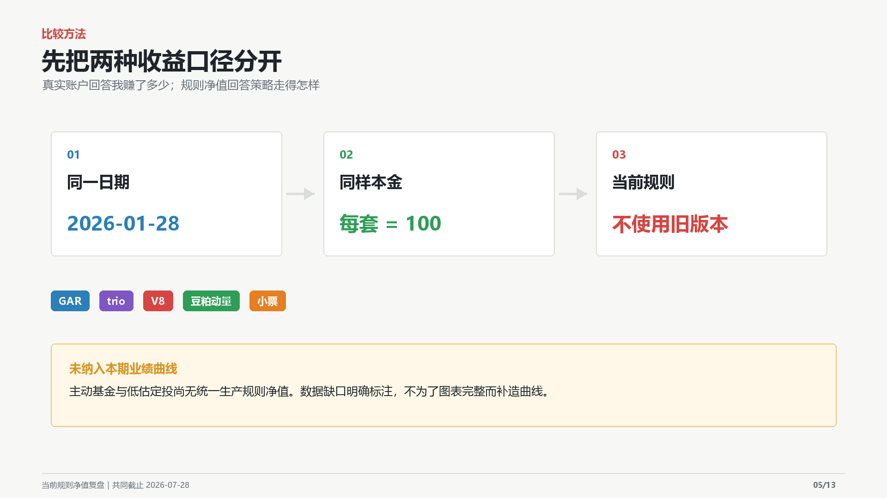
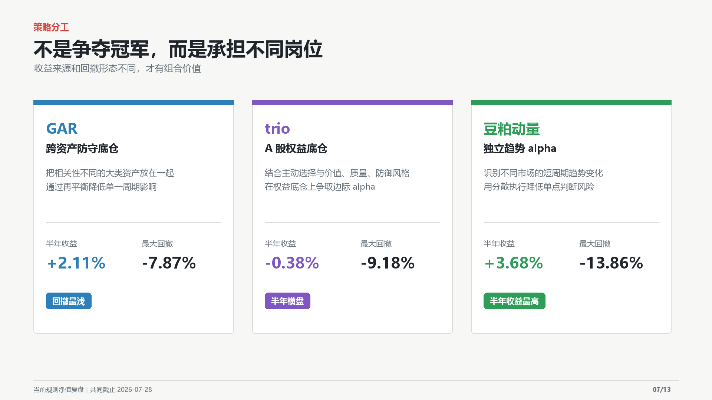
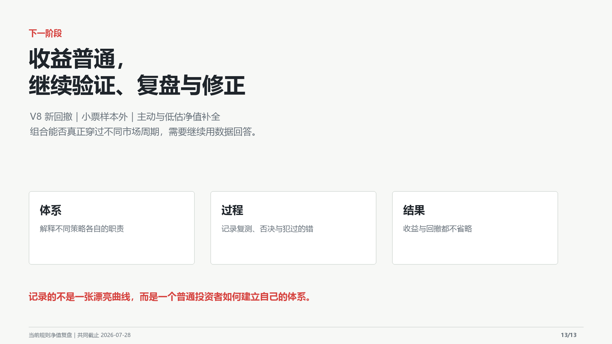

# 《近一年只赚 2.70%：一个普通投资者的交易体系复盘》

> 精剪 v2 时长约 8 分 11 秒。以下图片按最终播放顺序排列，录音以 `第二步_精剪_v2.wav` 为准。

## 00:00-00:54｜先把真实成绩放在前面

先把真实成绩放在前面。从二零二五年七月三十一日到二零二六年七月三十一日，我的汇总账户收益是百分之二点七零，同期上证上涨百分之五点九九，跑输三点二九个百分点。期间账户一度上涨百分之二十一点一八，最后回吐了大部分。这不是漂亮答卷，我也不是来教人赚钱。我想讲的是，一个普通投资者怎样慢慢搭出自己的交易体系。

## 00:54-02:13｜我的投资经历

我从二零一八年进入市场，最初只是小打小闹。到二零二零年，已经基本满仓场外基金。中间经历买房，绝大部分积蓄用在房子上，投资账户差不多重新起步。二零二四年九二四之后，我开始场内、场外并行。随着年纪增长，我越来越觉得，工作之外还应该有一项能够长期积累的能力。投资恰好是我感兴趣，也愿意长期学习的事情。但入市早不等于懂投资。回过头看，过去的我就是普通的路边韭菜，被消息和震荡裹挟：涨了兴奋，跌了恐慌，听到新逻辑就追，市场变脸又急着出来。

## 02:13-03:18｜承认主观投资没有天赋

大约一年半前，我终于承认：依靠主观投资，咱没那个天赋。继续猜消息、猜风格和涨跌，只会重复过去的循环。我需要的不是下一次蒙对，而是一套能够执行、能够复盘，错了也知道错在哪里的方法。于是我从零学回测，探索策略，再用小规模实盘验证。过程中不断实盘、推翻、改进、再实盘，也犯过数据口径、策略逻辑和风险认知上的错误。直到最近三四个月，框架才逐渐清晰：让规则替代感觉，让证据替代冲动。

## 03:18-04:14｜现在的交易体系与比较口径

目前我的体系有七套策略：GAR、trio、V8、豆粕动量、小票、主动基金和低估定投，覆盖跨资产平衡、权益底仓、趋势轮动、小盘量化、主动选择和估值思路。我把它们分成底仓、趋势、卫星和补充四类，再通过组合层约束风险。这个体系不是为了每天都涨，而是避免把整个账户押在同一种市场风格上。

前面的百分之二点七零，是包含建仓时间、资金进出和执行差异的真实账户结果。后面的曲线把已有连续净值的策略放到同一天，用同样本金和当前规则重新起跑，比较的是策略本身的收益路径。

## 04:14-04:45｜先看最近三年

三年窗口里，GAR、trio 和 V8 的累计收益大致处于相近区间，豆粕动量更高，小票的历史涨幅最突出。但高收益不能直接外推。小票明显受一段小微盘强势行情推动，豆粕动量和小票也承受了更深的回撤。窗口越长，越要解释收益来自稳定能力，还是特定市场阶段。

这里再把当前投资体系合成为一条理论组合曲线，与中证500放在同一起点比较。没有统一规则净值的部分按现金占位。这不是我的真实账户收益，也不代表未来仍能维持同样表现。

## 04:45-05:33｜再看最近六个月

最近六个月，五套策略的结果有涨有跌，前四套期末看似接近，但中途最大回撤差异很大，小票则处于明显逆风。真正拉开差距的，不只是最后赚了多少，而是为了这些收益承受了怎样的路径。

## 05:33-06:19｜策略不是争夺同一个冠军

GAR 通过低相关大类资产和再平衡降低单一周期影响。trio 承担权益底仓角色。V8 与豆粕动量提供趋势收益来源，小票则是高波动卫星策略。它们不在竞争同一个岗位；收益来源和回撤形态不同，才有组合价值。

## 06:19-07:11｜我的体系原则

这套体系可以浓缩成四条。第一，让跨资产、权益底仓、趋势和小盘模型各自分工。第二，在组合层限制单一策略风险，定期再平衡。第三，所有改动同时看年化、夏普、最大回撤和卡玛，再做分窗口与样本外验证。第四，新数据推翻旧结论时，承认错误并更新风险边界。体系不是让我永远正确，而是让我犯错后仍知道下一步怎么做。

## 07:11-08:11｜结尾

我水平很普通，最近一年也没跑赢上证，体系才刚稳定三四个月，离证明有效还很远。但从被行情推着走，到能够按规则执行、复盘和纠错，我已经很开心。分享出来，一是留下心路记录，二是接受长期检验。如果能顺便吃上一口自媒体的冷饭，我也很开心。接下来就看它会不会被市场打脸，又会怎样修正。

## 口径声明

真实账户收益来自账户汇总统计；策略曲线为当前定稿规则的理论净值比较，不等于真实账户收益。六个月和三年都不是完整市场周期，内容仅作个人策略研究复盘，不构成投资建议。
